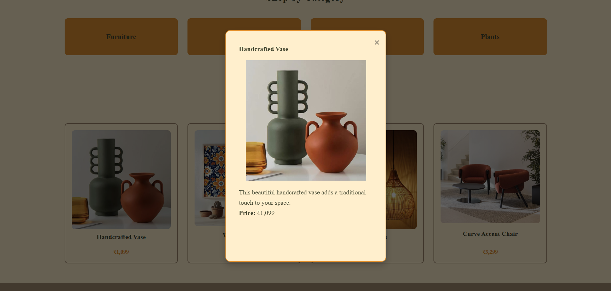
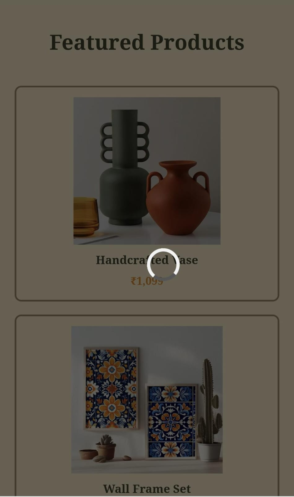

# task5

A responsive homepage built using HTML, CSS, and JavaScript, focused on enhancing user interaction through smooth transitions and animations. Key features include scroll-triggered fade-ins, a modal popup with animated loader, and custom CSS animations using `@keyframes`.

---

# Live Demo

[🔗 View Live](https://lisha2804.github.io/task5/)

---

# Screenshots

### Desktop View

### Mobile View

---
